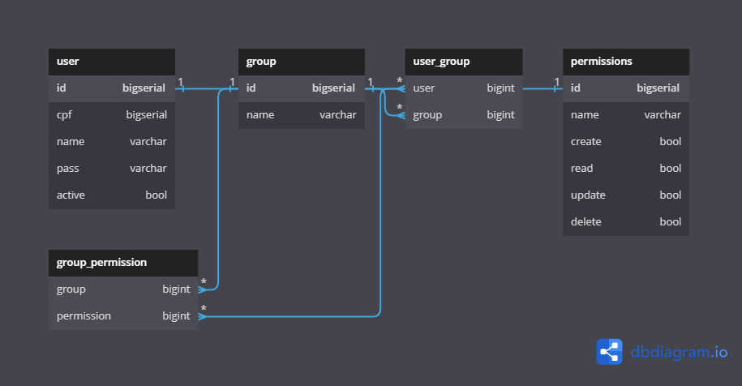

# Authentication Microservice

## Description

This project aims to implement an authentication microservice using the concept of microservices and grpc.

---

## User Stories

[ ] - User can register and login.

[ ] - User can access private page.

[ ] - User can create permissions and group permission.

[ ] - User can ascend to administrator.

[ ] - Admin can to manage users and permissions.

---

## Database diagram

---

## Usage

### Docker

''' Bash
docker-compose -d up
'''
